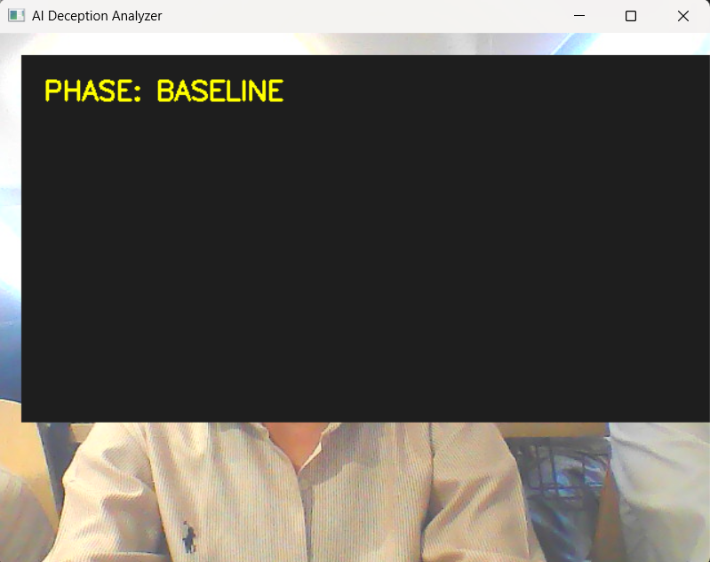
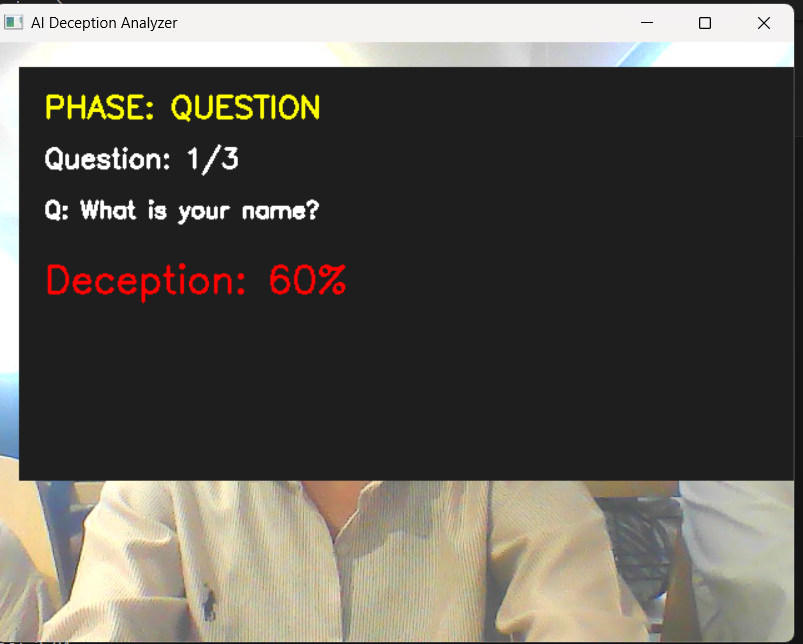
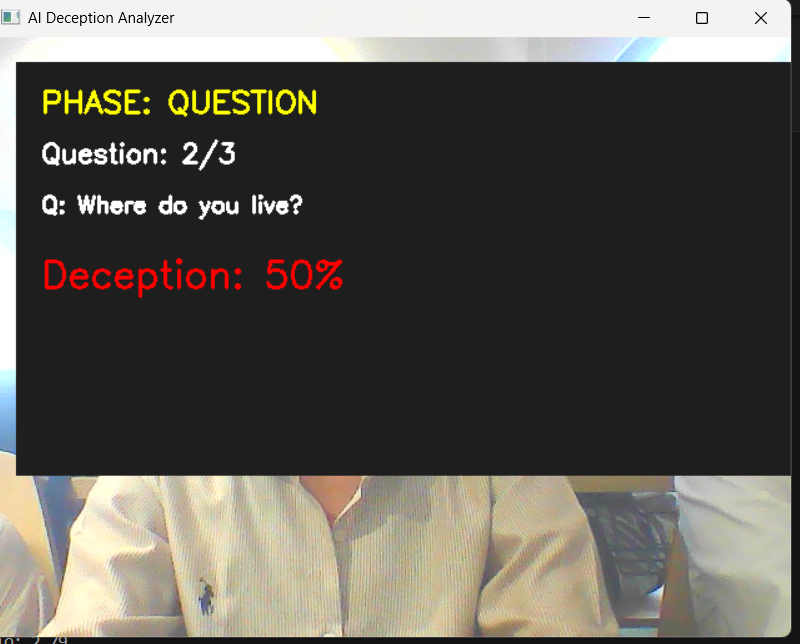
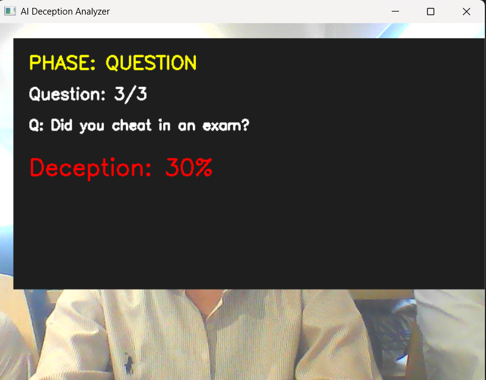

# 🧠 AI Deception Analyzer

### Real-Time Behavioral Analysis using Computer Vision

---

## 🚀 Overview

The AI Deception Analyzer is a real-time computer vision system designed to analyze behavioral patterns such as eye blinks and gaze direction to estimate a user's deception probability.

The system works in two phases:

1. **Baseline Phase** – Captures the user's natural behavior
2. **Question Phase** – Detects deviations from baseline during questioning

---

## ❓ Problem Statement

Traditional lie detection methods (like polygraphs) are intrusive, expensive, and often unreliable.
This project explores a **non-invasive, camera-based approach** using behavioral signals to estimate deception probability in real time.

---

## ⚙️ System Workflow

1. Capture live video using webcam
2. Detect facial landmarks using MediaPipe
3. Calculate Eye Aspect Ratio (EAR) for blink detection
4. Track gaze direction (Left / Right / Center)
5. Record baseline behavioral metrics
6. Compare real-time behavior with baseline
7. Generate deception score based on deviation

---

## 🧠 Features

* Real-time face and eye tracking
* Blink detection using Eye Aspect Ratio (EAR)
* Gaze direction tracking
* Baseline behavior calibration
* Question-based analysis system
* Deception score generation (%)
* Results logging in CSV

---

## 🛠️ Tech Stack

* Python
* OpenCV
* MediaPipe
* NumPy

---

## 📊 Deception Score Logic

The deception score is calculated based on deviation from baseline behavior:

Deception Score =
(w1 × Blink Rate Deviation) +
(w2 × Gaze Deviation)

Where:

* Blink Rate Deviation = Difference from baseline blink rate
* Gaze Deviation = Frequency of abnormal gaze shifts
* w1, w2 = Weight factors

---

## ▶️ How to Run

### 1. Clone the repository

```bash
git clone https://github.com/kushagra-4263/AI-Deception-Analyzer.git
cd AI-Deception-Analyzer
```

### 2. Install dependencies

```bash
pip install -r requirements.txt
```

### 3. Run the project

```bash
python main.py
```

---

## 📸 Demo

### 🔹 Baseline Phase



### 🔹 Question Phase




### 🔹 Final Output



---

## 📈 Sample Output

| Question | Blink Rate | Gaze   | Deception Score |
| -------- | ---------- | ------ | --------------- |
| Q1       | High       | Left   | 60%             |
| Q2       | Medium     | Center | 50%             |
| Q3       | Low        | Center | 30%             |

---

## 💡 Use Cases

* Interview behavior analysis
* Research in human behavior
* Human-computer interaction systems
* Prototype for non-invasive lie detection

---

## ⚠️ Limitations

* Not a scientifically validated lie detector
* Sensitive to lighting conditions
* Requires stable camera positioning
* Results may vary across individuals

---

## 🔮 Future Scope

* Machine Learning-based prediction model
* Facial expression analysis
* Voice-based stress detection
* Improved accuracy with dataset training
* Web/App interface (Streamlit or Flask)

---

## 👤 Author

**Kushagra Mishra**
MCA (AI/ML)

---

## 📌 Disclaimer

This project is a prototype and is intended for educational and research purposes only. It does not provide definitive lie detection.
